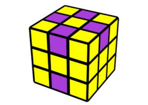
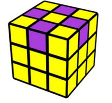
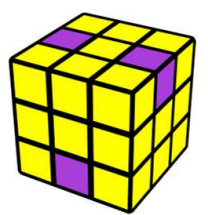
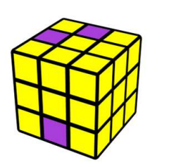
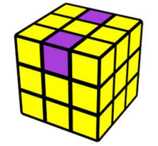
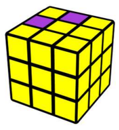
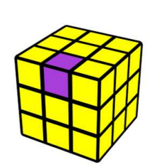
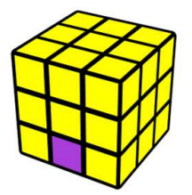
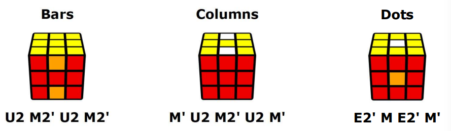
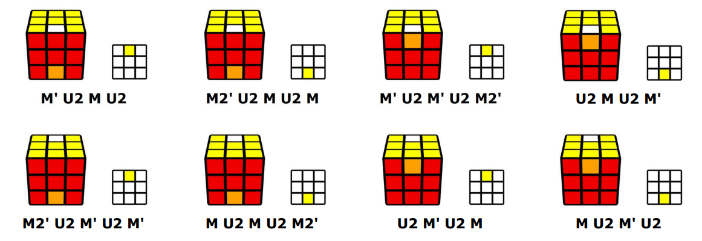

# EO

- n / m 代表顶层和底层错误色相的数量

- 标态和六棱

| 3/1  标态                                                    | 4/2 六棱                                                     |
| ------------------------------------------------------------ | ------------------------------------------------------------ |
|  |  |
| M U' M   **FU FD**                                           | M' U M U2 M U M' U M U' M'                                   |
| M' U' M'  **FU BD**                                          |                                                              |
| 如果底棱在后， 用M'， 反之用M                                |                                                              |

- 四棱

|                                                              |                                                              |
| ------------------------------------------------------------ | ------------------------------------------------------------ |
| **4/0**                                                      | **2/2**                                                      |
|  |  |
| M' U2 M' U2  + 标态                                          | M' U2 M' U2 + 标态                                           |
| (M' U2 M' U2) (M' U' M')                                     | (M' U2 M' U2) (M U' M')                                      |
|                                                              |                                                              |
| **2/2**                                                      |                                                              |
|  |                                                              |
| M2 U' +  标态                                                |                                                              |
| (M2 U') (M' U' M')                                           |                                                              |

- 二棱

|                                                              |                                                              |
| ------------------------------------------------------------ | ------------------------------------------------------------ |
| **2/0**                                                      | **2/0 临棱**                                                 |
|  |  |
| M' U M U' + 标态                                             | M' U M' U2 +  标态                                           |
| (M' U M U') (M' U' M')                                       | (M' U M' U2) (M' U' M')                                      |
|                                                              |                                                              |
| **1/1**                                                      | **0/2**                                                      |
|  |  |
| M' U' M' U' +  标态                                          | M' U M' U' + 标态                                            |
| (M' U' M' U') (M U' M')                                      | (M' U M' U') (M U' M')                                       |

# EP

- 四棱

- 三棱

