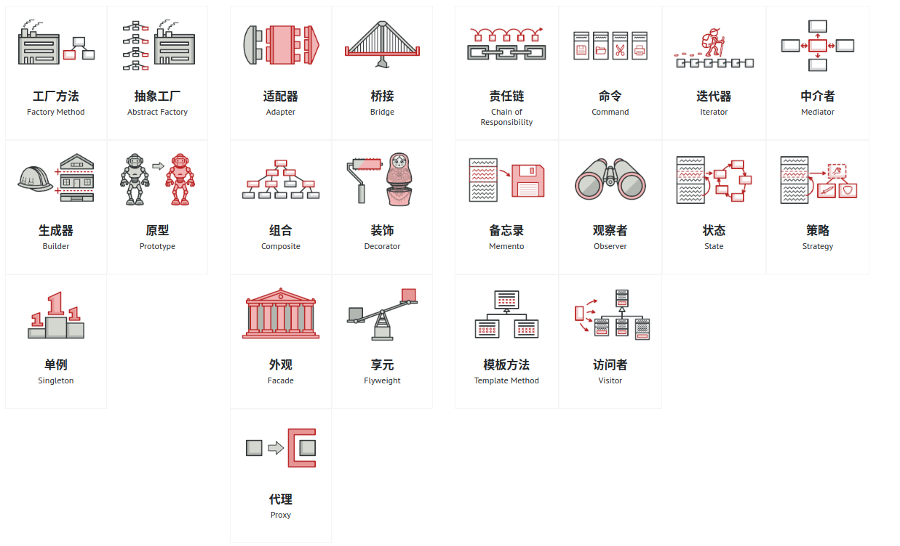

#  设计模式

> copy to: https://refactoringguru.cn/design-patterns/catalog
>
> 原文来自以上链接，对其中的一些内容做了自己的理解和整理。

- 设计模式可分为三种大分类
    - 1、==创建型== 这类模式提供创建对象的机制， 能够提升已有代码的灵活性和可复用性。
    - 2、==结构型== 这类模式介绍如何将对象和类组装成较大的结构， 并同时保持结构的灵活和高效。
    - 3、==行为模式== 这类模式负责对象间的高效沟通和职责委派。

## 一、创建型模式

### 1、工厂模式

#### 模式简介

1. **产品** （Product） 将会对接口进行声明。 对于所有由创建者及其子类构建的对象， 这些接口都是通用的。

2. **具体产品** （Concrete Products） 是产品接口的不同实现。

3. **创建者** （Creator） 类声明返回产品对象的工厂方法。 该方法的返回对象类型必须与产品接口相匹配。

    你可以将工厂方法声明为抽象方法， 强制要求每个子类以不同方式实现该方法。 或者， 你也可以在基础工厂方法中返回默认产品类型。尽管它的名字是创建者， 但它最主要的职责并**不是**创建产品。 一般来说， 创建者类包含一些与产品相关的核心业务逻辑。 工厂方法将这些逻辑处理从具体产品类中分离出来。 这里的创建者只是指导具体创建者去实现相关类方法的。

4. **具体创建者** （Concrete Creators） 将会重写基础工厂方法， 使其返回不同类型的产品。

#### 使用场景