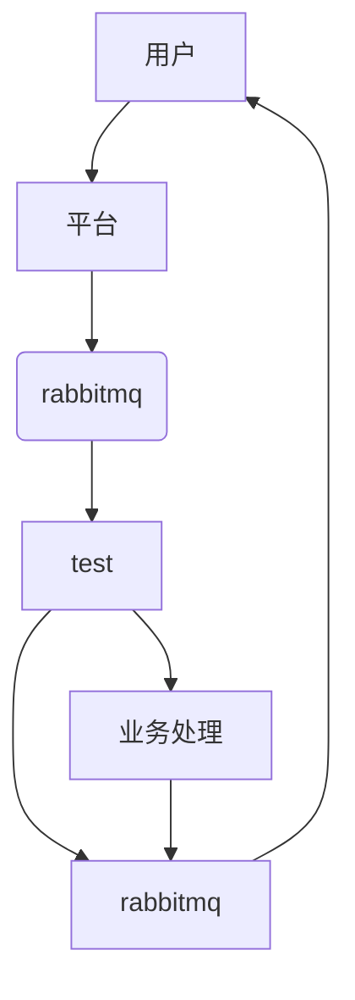

<h1><center>疑难杂症2.0</center></h1>


## 一、typora相关使用

### 1.1 md流程图



### 1.2 时序图

```sequence
participant dev as dev
participant M2M as M2M
participant rule
participant shadow

note over app,dev :设备同步自身属性
dev->M2M:设备上线获取属性
M2M-->shadow:订阅通知
shadow->shadow:自查消息同步
shadow-->M2M:下发对应影子消息
M2M->dev:下发属性
note over app,dev :设备上报自身属性
dev->M2M:设备上报自身属性
M2M->rule:订阅通知到规则引擎 
rule->rule:解析数据
rule->shadow:订阅通知
shadow->shadow:检查保存
```


 


## 二、安装docker及存储三件套

### 2.0 docker相关应用

```
--restart=always # 自重启
-p 16210:16210 # 端口挂载
-v /data/ada:/data/cmdb # 地址挂载
```

### 2.1 docker

```bash
apt-get update
apt-get install -y apt-transport-https ca-certificates curl software-properties-common
curl -fsSL https://download.docker.com/linux/ubuntu/gpg | apt-key add -
add-apt-repository "deb [arch=amd64] https://download.docker.com/linux/ubuntu $(lsb_release -cs) stable" >/dev/null 2>&1
apt-get update
apt-get install -y docker.io

systemctl enable docker
systemctl restart docker

usermod -aG docker guojia
```

### 2.2 mariadb（mysql）

```bash
docker pull mariadb
mkdir -p /data/mariadb/data

docker run --name mariadb -p 3306:3306 -e MYSQL_ROOT_PASSWORD=123456 -v /data/mariadb/data:/var/lib/mysql -d --restart=always mariadb
```

### 2.3 mongo

```bash
docker pull mongo

docker run -itd --name mongo -p 27017:27017 -d --restart=always mongo --auth
```

### 2.4 redis

```bash
docker pull redis

wget http://download.redis.io/releases/redis-6.0.6.tar.gz
tar -zxvf redis-6.0.6.tar.gz

mkdir -p /data/redis/data
cp -p redis-6.0.6/redis.conf /data/redis

docker run -p 6379:6379 --name redis -v /data/redis/redis.conf:/etc/redis/redis.conf  -v /data/redis/data:/data -d --restart=always redis redis-server /etc/redis/redis.conf --appendonly yes


docker run -p 6379:16379 --name redis -d --restart=always redis


------------------------------------
docker run --name rabbitmq -d -p 15672:15672 -p 5672:5672 rabbitmq:management

操作
启动容器，命令：docker start rabbitmq
停止容器，命令：docker stop rabbitmq
重启容器，命令：docker restart rabbitmq
进入容器，命令：docker exec -it rabbitmq bash
```

## 三 、Kafka安装

### 3.1、安装运行Zookeeper

```
docker run -d --name zookeeper -p 2181:2181 wurstmeister/zookeeper
```

### 3.2、安装运行Kafka

```shell
docker run -d --name kafka -p 9092:9092 -e KAFKA_BROKER_ID=0 -e KAFKA_ZOOKEEPER_CONNECT=zookeeper:2181 --link zookeeper -e KAFKA_ADVERTISED_LISTENERS=PLAINTEXT://localhost:9092 -e KAFKA_LISTENERS=PLAINTEXT://0.0.0.0:9092 -t wurstmeister/kafka
```

### 3.3、消费者开启消费

```shell
kafka-console-consumer.sh --bootstrap-server PLAINTEXT://localhost:9092 --topic kafeidou --from-beginning
```

### 3.4、生产者发布消息

```shell
kafka-console-producer.sh --broker-list localhost:9092 --topic kafeidou
```

### 3.5、kafka -manger

```
docker run -d --name kfk-manager --restart always -p 9000:9000 -e ZK_HOSTS=0.0.0.0:2181 sheepkiller/kafka-manager
```

## 四、pip及环境相关

### 4.0 pip 及python环境安装

```
virtualenv -p /usr/local/bin/python3.7 .env
source ./.env/bin/activate
```

#### 4.0.1 下载安装包, 可更换版本

镜像 ： http://npm.taobao.org/mirrors/python/

```
wget https://cdn.npm.taobao.org/dist/python/3.9.7/Python-3.9.7.tgz
tar xvf Python-3.9.1.tgz
cd Python-3.9.1
```

#### 4.0.2 下载依赖

- ubuntu

```shell
sudo apt-get install gcc make zlib1g-dev libbz2-dev libsqlite3-dev python3-dev libxml2-dev libffi-dev libssl-dev libxslt1-dev
```

- centos

```shell
yum -y install gcc zlib* libffi-devel 
yum -y install lib* --skip-broken  (慎重，2G的安装包，涵盖所有未来有可能用到的依赖)
```

#### 4.0.3 更改setup文件

取消该文件```/data/Python-3.9.7/Modules/Setup```中关于ssl的注释 ，好像3.9以后不用，但是保险起见可以注释一下

```
SSL=/usr/local/ssl
_ssl _ssl.c \
        -DUSE_SSL -I$(SSL)/include -I$(SSL)/include/openssl \
        -L$(SSL)/lib -lssl -lcrypto
```

#### 4.0.4 配置configure

不添加--enable-optimizations 即不做优化

```
./configure --with-ssl --prefix=/usr/local/bin/python3  --enable-optimizations 
```

#### 4.0.5 安装

```
make
make install
```

#### 4.0.6 软连接

```
rm -rf /usr/bin/python3.9
ln -s /usr/local/bin/python3/bin/python3 /usr/bin/python
ln -s /usr/local/bin/python3/bin/pip3 /usr/bin/pip
```

#### 4.0.7 环境管理

```
pip install virtualenv
ln -s /usr/local/bin/python3/bin/virtualenv /usr/bin/virtualenv
```

### 4.1 pip更新依赖库

```
pip install pip-tools
pip-compile --output-file=build/requirements/requirements.txt build/requirements/requirements.in
```

### 4.2  pip安装不上mysqlclient

pymysql 替代，在根`__init.py`下

```
import pymysql
pymysql.install_as_MySQLdb()
```

```
env LDFLAGS="-I/usr/local/opt/openssl/include -L/usr/local/opt/openssl/lib" pip --no-cache install mysqlclient==1.4.6
```

### 4.3 python2无法安装mysql-python 

```
https://www.lfd.uci.edu/~gohlke/pythonlibs/#mysql-python
https://terrluo.github.io/2020/04/25/Mac-%E4%B8%8B-python2-%E5%AE%89%E8%A3%85-Mysql-Python/

xcode-select --install
重装mysql 大法
```


### 4.4 consul

```shell
./consul agent -server -bootstrap-expect 1 -data-dir=/Users/caime/Desktop/consuldata -node=n1 -bind=127.0.0.1 -client=0.0.0.0 -ui
```

```shell
./consul agent 
	-server 
	-bootstrap-expect 1 
	-ui
	-data-dir=/tmp/consul # /Users/caime/Desktop/consuldata
	-node=n1 
	-bind=127.0.0.1 
	-client=0.0.0.0 
```

4.5 启动docker compse 并依赖consul

* 项目结构

```
- app   # 用于存放镜像项目的地方
- appprocuce  # 项目地址
- docker-compose.yml
```

* 配置docker-compose.yml

```yaml
version: '1.2.3'
services:
  DeviceBoot:
    image: ccr.ccs.tencentyun.com/data/device:2.4.3-2
    environment:
    - CONSUL_HTTP_ADDR=127.0.0.1:8500
    - CONSUL_KV_DOMAIN=consul_db
    hostname: consul
    restart: always
    ports:
      - 8880:80
    network_mode: host
    volumes:
      - /Users/caime/Desktop/data/bo/device-boot:/app
```

* 启动

```
docker-compose up -d
docker login -u {user} -p {password} ccr.ccs.tencentyun.com
docker-compose exec DeviceBoot bash
supervisorctl stop all
python manage.py runserver 0:80
```

### 4.6 mac os brew速度慢

```shell
# 查看 brew.git 当前源
$ cd "$(brew --repo)" && git remote -v
origin    https://github.com/Homebrew/brew.git (fetch)
origin    https://github.com/Homebrew/brew.git (push)

# 查看 homebrew-core.git 当前源
$ cd "$(brew --repo homebrew/core)" && git remote -v
origin    https://github.com/Homebrew/homebrew-core.git (fetch)
origin    https://github.com/Homebrew/homebrew-core.git (push)

# 修改 brew.git 为阿里源
$ git -C "$(brew --repo)" remote set-url origin https://mirrors.aliyun.com/homebrew/brew.git

# 修改 homebrew-core.git 为阿里源
$ git -C "$(brew --repo homebrew/core)" remote set-url origin https://mirrors.aliyun.com/homebrew/homebrew-core.git

# zsh 替换 brew bintray 镜像
$ echo 'export HOMEBREW_BOTTLE_DOMAIN=https://mirrors.aliyun.com/homebrew/homebrew-bottles' >> ~/.zshrc
$ source ~/.zshrc

# bash 替换 brew bintray 镜像
$ echo 'export HOMEBREW_BOTTLE_DOMAIN=https://mirrors.aliyun.com/homebrew/homebrew-bottles' >> ~/.bash_profile
$ source ~/.bash_profile

# 刷新源
$ brew update

# 换源
export HOMEBREW_BOTTLE_DOMAIN=https://mirrors.tuna.tsinghua.edu.cn/homebrew-bottles
```

### 4.7 opencv安装

#### 4.7.1 python安装

```
pip install opencv-python
```

#### 4.7.2 go环境安装

```shell
apt clean
apt update 
apt-get -y install  build-essential cmake libgtk2.0-dev pkg-config libavcodec-dev libavformat-dev libswscale-dev libtbb2 libtbb-dev libjpeg-dev libpng-dev libtiff-dev libdc1394-22-dev

ldconfig && go env -w GOPROXY=https://goproxy.cn 

go get -u -d gocv.io/x/gocv
cd $GOPATH/src/gocv.io/x/gocv
sed -i 's/sudo //g' Makefile
make install
```

#### 4.7.3 mac os 安装

```
brew install opencv
```

#### 4.7.4 编译安装

```
// 下载安装包
https://opencv.org/releases/
wget https://codeload.github.com/opencv/opencv/zip/4.5.3
unzip opencv-4.5.4.zip

mdkir release
cd release
cmake -G "Unix Makefiles" ..

make
make install
```

- cmake优化安装

```
cmake -DCMAKE_BUILD_TYPE=Release \
-DOPENCV_GENERATE_PKGCONFIG=ON \
-DCMAKE_INSTALL_PREFIX=/usr/local ..
```

- cmake全量安装

```
cmake -D BUILD_TIFF=ON -D WITH_CUDA=OFF -D ENABLE_AVX=OFF -D WITH_OPENGL=OFF -D WITH_OPENCL=OFF -D WITH_IPP=OFF -D WITH_TBB=ON -D BUILD_TBB=ON -D WITH_EIGEN=OFF -D WITH_V4L=OFF -D WITH_VTK=OFF -D BUILD_TESTS=OFF -D BUILD_PERF_TESTS=OFF -D CMAKE_BUILD_TYPE=RELEASE -D CMAKE_INSTALL_PREFIX=/usr/local -D OPENCV_EXTRA_MODULES_PATH=/opt/opencv_contrib/modules /opt/opencv/
```

#### 4.7.5 ubuntu 安装

##### 系统更新

```shell
apt-get update
apt-get upgrade
apt update
apt-get install software-properties-common
```

##### 依赖安装

```shell
apt-get install build-essential cmake git libgtk2.0-dev pkg-config libavcodec-dev libavformat-dev libswscale-dev
add-apt-repository "deb http://security.ubuntu.com/ubuntu xenial-security main"
apt update
apt-get install libjpeg-dev libpng-dev libtiff5-dev libjasper-dev libdc1394-22-dev libeigen3-dev libtheora-dev libvorbis-dev libxvidcore-dev libx264-dev sphinx-common libtbb-dev yasm libfaac-dev libopencore-amrnb-dev libopencore-amrwb-dev libopenexr-dev libgstreamer-plugins-base1.0-dev libavutil-dev libavfilter-dev libavresample-dev
```

##### 下载

```
cd /opt 
git clone https://github.com/opencv/opencv.git
cd opencv 
mkdir release && cd release
apt-get install qt5-default
```

#### 4.7.6 docker安装

```
https://learnopencv.com/install-opencv-docker-image-ubuntu-macos-windows/
```

```shell
docker pull spmallick/opencv-docker:opencv

docker run --device=/dev/video0:/dev/video0 -v /tmp:/tmp -e DISPLAY=$DISPLAY -p 5000:5000 -p 8888:8888 -it spmallick/opencv-docker:opencv /bin/bash

–device=/dev/video0:/dev/video0允许使用网络摄像头
-v /tmp/.X11-unix:/tmp/.X11-unix有助于 X11 转发，以便我们可以使用cv::imshow 之类的函数。
-e用于传递环境变量。
- 它开始一个交互式会话
-p设置端口转发。此标志将容器的端口映射到主机系统上的端口。
/bin/bash在启动时运行.bashrc文件
```

### 4.8 brew 安装

```
https://gitee.com/cunkai/HomebrewCN
/bin/zsh -c "$(curl -fsSL https://gitee.com/cunkai/HomebrewCN/raw/master/Homebrew.sh)"
```

### 4.9 go环境安装

```shell
wget https://studygolang.com/dl/golang/go1.18.7.linux-armv6l.tar.gz
sudo tar -zxvf go1.18.7.linux-armv6l.tar.gz -C /usr/local/

# go env配置
sudo sh -c 'echo "export GOROOT=/usr/local/go" >> /etc/profile'
sudo sh -c 'echo "export PATH=\$PATH:\$GOROOT/bin" >> /etc/profile'
source /etc/profile

echo "export GO111MODULE=on" >> ~/.profile
echo "export GOPROXY=https://goproxy.cn" >> ~/.profile
source ~/.profile


# 开发环境配置
go env -w GONOPROXY="gitee.com"
go env -w GONOSUMDB="gitee.com"
go env -w GOPRIVATE="gitee.com"

# 写到 ~/.gitconfig
[url "git@gitee.com:"]
        insteadOf = https://gitee.com/
[user]
        email = guojia@guojia.com
        name = guojia


# 写到./ssh/config
# gitee
Host gitee.com
  HostName gitee.com
  PreferredAuthentications publickey
  IdentityFile ~/.ssh/edge_id
# github
Host github.com
  HostName github.com
  PreferredAuthentications publickey
  IdentityFile ~/.ssh/id_rsa
  
chmod 0600 ~/.ssh/edge_id
ssh -T git@gitee.com
```

### 4.10 挂载

#### 4.10.1 nas挂载

```shell
apt-get install smbclient
smbclient -L 192.168.0.6 -U {user}
mount -t cifs -o username={user},password=1234 //192.168.1.26/{user}_Home1 /data/images/nas
## 自动挂载 添加一句在/etc/fstab文件 
//192.168.1.2/{user}_Home2 /data/nas cifs username={user},password=1234 0 0
//192.168.0.6/{user}_Home1 /data/nas cifs username={user},password=1234 0 0

mount -t cifs -o username=AirDisk,password=go4123456 //192.168.0.210/NewDisk-A /data/nas


// 旧
smbclient -L 192.168.0.210 -U AirDisk
mount -t cifs -o username=AirDisk,password=123456 //192.168.0.210/NewDisk-A /data/nas
//192.168.0.210/NewDisk-A /data/nas cifs username=AirDisk,password=123456 0 0


mount -t cifs -o username={user},password=1234 //10.108.0.2/{user}_Home1 /data/images/nas


mount -t cifs -o username={user},password=1234 //10.108.0.2/{user}_Home1/QCR_IMAGE /data/nas/nas1
mount -t cifs -o username={user},password=1234 //10.108.0.4/{user}_Home1/QCR_IMAGE /data/nas/nas2
```

## 五、开发工具及出现的问题

### 5.1 idea 无法输入中文

```shell
点击 help
点击 Edit Custom VM options
在末行添加： -Drecreate.x11.input.method=true
```

### 5.2 串口调试工具

> 参考： https://blog.csdn.net/maizousidemao/article/details/103236666

```bash
sudo apt install minicom
```

### 5.3 Deepin boot make 工具安装

```shell
sudo echo 'deb http://packages.deepin.com/deepin stable main contrib non-free' > /etc/apt/sources.list.d/deepin.list


sudo apt-key adv --keyserver keyserver.ubuntu.com --recv-keys 425956BB3E31DF51
sudo apt update
sudo apt install deepin-boot-maker

deepin-boot-maker
```


## 六、Git 相关

### 6.1 删除历史大文件

```shell
# 查找大文件
git rev-list --objects --all | grep "$(git verify-pack -v .git/objects/pack/*.idx | sort -k 3 -n | tail -10 | awk '{print$1}')"

# 重写文件的记录日志
git filter-branch --force --index-filter 'git rm -rf --cached --ignore-unmatch 【file_name】' --prune-empty --tag-name-filter cat -- --all
git filter-branch --force --index-filter 'git rm -rf --cached --ignore-unmatch [file_name]' --prune-empty --tag-name-filter cat -- --all

# 强制推送
git push origin master --force

# 删除git记录
rm -rf .git/refs/original/
git reflog expire --expire=now --all
git gc --prune=now

# 推
git push
```


## 七、linux 内核恐慌

### 7.0 主动恐慌

```
# 立即重新启动计算机

echo "b" > /proc/sysrq-trigger

# 立即关闭计算机
echo "o" > /proc/sysrq-trigger

# 导出内存分配的信息 （可以用/var/log/message 查看）
echo "m" > /proc/sysrq-trigger

# 导出当前CPU寄存器信息和标志位的信息
echo "p" > /proc/sysrq-trigger

# 导出线程状态信息
echo "t" > /proc/sysrq-trigger

# 故意让系统崩溃
echo "c" > /proc/sysrq-trigger

# 立即重新挂载所有的文件系统
echo "s" > /proc/sysrq-trigger

# 立即重新挂载所有的文件系统为只读
echo "u" > /proc/sysrq-trigger
```

### 7.1 wlan0电源 问题

```
https://ubuntuqa.com/zh-tw/article/6911.html
```


## 八、压缩解压

### 8.1 linux 压缩

```
 tar zcvf a0.tar.gz file1 file2
```


## 九、CGO

### 9.1 go 构建so

编辑一个go函数

```go
package main

import "C"

//export Sum
func Sum(a, b int) int {
	return a + b + 1
}

func main() {}
```

执行如下命令：

```shell
go build -buildmode=c-shared -o xxx.so xxx.go
```

将会生成so文件和.h文件

**调用1**

```go
lib, err := dl.Open("/usr/local/lib/xxx.so", 0)
if err != nil {
    panic(err)
}
defer lib.Close()

var Sum func(a C.longlong, b C.longlong) int64
lib.Sym("Sum", &Sum)
data := Sum(C.longlong(a), C.longlong(b))
```

**调用2**


```go
package use

/*
#cgo CFLAGS: -IC./
#cgo LDFLAGS: -LC./ -lsum
#include "sum.h"
*/
import "C"
import (
	"fmt"
	"time"
)

func RunSum(a, b int) {
	data := C.Sum(C.longlong(a), C.longlong(b))
	fmt.Println(time.Now(), "=============", data)
}
```


## 十、jump - server

- ```
  https://www.lixin.help/2021/06/01/Jumpserver-Install.html
  https://www.ywbj.cc/?p=907
  https://bbs.huaweicloud.com/blogs/374980
  https://www.gordon2000.com/2022/03/jumpserver.html
  ```

- 安装

```yaml
sudo pip install docker-compose
https://github.com/jumpserver/jumpserver/releases/download/v2.25.1/quick_start.sh
```

```yaml
git@github.com:jumpserver/installer.git
cd installer
```

```
wget https://github.com/jumpserver/jumpserver/releases/download/v2.10.4/jumpserver-v2.21.0.tar.gz
tar -zxvf jumpserver-v2.21.0.tar.gz

```


- 管理

```yaml
# 启动
$ ./jmsctl.sh start

# 重启
$ ./jmsctl.sh restart

# 关闭, 不包含数据库
$ ./jmsctl.sh stop

# 关闭所有
$ ./jmsctl.sh down

# 备份数据库
$ ./jmsctl.sh backup_db

# 查看日志
$ ./jmsctl.sh tail
```

- web ui

```
git clone git@github.com:jumpserver/luna.git
cd luna
```

## 十一、curl错误码表

| **CURL状态码列表** |                      |                                                              |
| ------------------ | -------------------- | ------------------------------------------------------------ |
| 状态码             | 状态原因             | 解释                                                         |
| 0                  | 正常访问             |                                                              |
| 1                  | 错误的协议           | 未支持的协议。此版cURL 不支持这一协议。                      |
| 2                  | 初始化代码失败       | 初始化失败。                                                 |
| 3                  | URL格式不正确        | URL 格式错误。语法不正确。                                   |
| 4                  | 请求协议错误         |                                                              |
| 5                  | 无法解析代理         | 无法解析代理。无法解析给定代理主机。                         |
| 6                  | 无法解析主机地址     | 无法解析主机。无法解析给定的远程主机。                       |
| 7                  | 无法连接到主机       | 无法连接到主机。                                             |
| 8                  | 远程服务器不可用     | FTP 非正常的服务器应答。cURL 无法解析服务器发送的数据。      |
| 9                  | 访问资源错误         | FTP 访问被拒绝。服务器拒绝登入或无法获取您想要的特定资源或目录。最有可 能的是您试图进入一个在此服务器上不存在的目录。 |
| 11                 | FTP密码错误          | FTP 非正常的PASS 回复。cURL 无法解析发送到PASS 请求的应答。  |
| 13                 | 结果错误             | FTP 非正常的的PASV 应答，cURL 无法解析发送到PASV 请求的应答。 |
| 14                 | FTP回应PASV命令      | FTP 非正常的227格式。cURL 无法解析服务器发送的227行。        |
| 15                 | 内部故障             | FTP 无法连接到主机。无法解析在227行中获取的主机IP。          |
| 17                 | 设置传输模式为二进制 | FTP 无法设定为二进制传输。无法改变传输方式到二进制。         |
| 18                 | 文件传输短或大于预期 | 部分文件。只有部分文件被传输。                               |
| 19                 | RETR命令传输完成     | FTP 不能下载/访问给定的文件， RETR (或类似)命令失败。        |
| 21                 | 命令成功完成         | FTP quote 错误。quote 命令从服务器返回错误。                 |
| 22                 | 返回正常             | HTTP 找不到网页。找不到所请求的URL 或返回另一个HTTP 400或以上错误。 此返回代码只出现在使用了-f/--fail 选项以后。 |
| 23                 | 数据写入失败         | 写入错误。cURL 无法向本地文件系统或类似目的写入数据。        |
| 25                 | 无法启动上传         | FTP 无法STOR 文件。服务器拒绝了用于FTP 上传的STOR 操作。     |
| 26                 | 回调错误             | 读错误。各类读取问题。                                       |
| 27                 | 内存分配请求失败     | 内存不足。内存分配请求失败。                                 |
| 28                 | 访问超时             | 操作超时。到达指定的超时期限条件。                           |
| 30                 | FTP端口错误          | FTP PORT 失败。PORT 命令失败。并非所有的FTP 服务器支持PORT 命令，请 尝试使用被动(PASV)传输代替！ |
| 31                 | FTP错误              | FTP 无法使用REST 命令。REST 命令失败。此命令用来恢复的FTP 传输。 |
| 33                 | 不支持请求           | HTTP range 错误。range "命令"不起作用。                      |
| 34                 | 内部发生错误         | HTTP POST 错误。内部POST 请求产生错误。                      |
| 35                 | SSL/TLS握手失败      | SSL 连接错误。SSL 握手失败。                                 |
| 36                 | 下载无法恢复         | FTP 续传损坏。不能继续早些时候被中止的下载。                 |
| 37                 | 文件权限错误         | 文件无法读取。无法打开文件。权限问题？                       |
| 38                 | LDAP可没有约束力     | LDAP 无法绑定。LDAP 绑定(bind)操作失败。                     |
| 39                 | LDAP搜索失败         | LDAP 搜索失败。                                              |
| 41                 | 函数没有找到         | 功能无法找到。无法找到必要的LDAP 功能。                      |
| 42                 | 中止的回调           | 由回调终止。应用程序告知cURL 终止运作。                      |
| 43                 | 内部错误             | 内部错误。由一个不正确参数调用了功能。                       |
| 45                 | 接口错误             | 接口错误。指定的外发接口无法使用。                           |
| 47                 | 过多的重定向         | 过多的重定向。cURL 达到了跟随重定向设定的最大限额跟          |
| 48                 | 无法识别选项         | 指定了未知TELNET 选项。                                      |
| 49                 | TELNET格式错误       | 不合式的telnet 选项。                                        |
| 51                 | 远程服务器的SSL证书  | peer 的SSL 证书或SSH 的MD5指纹没有确定。                     |
| 52                 | 服务器无返回内容     | 服务器无任何应答，该情况在此处被认为是一个错误。             |
| 53                 | 加密引擎未找到       | 找不到SSL 加密引擎。                                         |
| 54                 | 设定默认SSL加密失败  | 无法将SSL 加密引擎设置为默认。                               |
| 55                 | 无法发送网络数据     | 发送网络数据失败。                                           |
| 56                 | 衰竭接收网络数据     | 在接收网络数据时失败。                                       |
| 57                 |                      |                                                              |
| 58                 | 本地客户端证书       | 本地证书有问题。                                             |
| 59                 | 无法使用密码         | 无法使用指定的SSL 密码。                                     |
| 60                 | 凭证无法验证         | peer 证书无法被已知的CA 证书验证。                           |
| 61                 | 无法识别的传输编码   | 无法辨识的传输编码。                                         |
| 62                 | 无效的LDAP URL       | 无效的LDAP URL。                                             |
| 63                 | 文件超过最大大小     | 超过最大文件尺寸。                                           |
| 64                 | FTP失败              | 要求的FTP 的SSL 水平失败。                                   |
| 65                 | 倒带操作失败         | 发送此数据需要的回卷(rewind)失败。                           |
| 66                 | SSL引擎失败          | 初始化SSL 引擎失败。                                         |
| 67                 | 服务器拒绝登录       | 用户名、密码或类似的信息未被接受，cURL 登录失败。            |
| 68                 | 未找到文件           | 在TFTP 服务器上找不到文件。                                  |
| 69                 | 无权限               | TFTP 服务器权限有问题。                                      |
| 70                 | 超出服务器磁盘空间   | TFTP 服务器磁盘空间不足。                                    |
| 71                 | 非法TFTP操作         | 非法的TFTP 操作。                                            |
| 72                 | 未知TFTP传输的ID     | 未知TFTP 传输编号(ID)。                                      |
| 73                 | 文件已经存在         | 文件已存在(TFTP) 。                                          |
| 74                 | 错误TFTP服务器       | 无此用户(TFTP) 。                                            |
| 75                 | 字符转换失败         | 字符转换失败。                                               |
| 76                 | 必须记录回调         | 需要字符转换功能。                                           |
| 77                 | CA证书权限           | 读SSL 证书出现问题(路径？访问权限？ ) 。                     |
| 78                 | URL中引用资源不存在  | URL 中引用的资源不存在。                                     |
| 79                 | 错误发生在SSH会话    | SSH 会话期间发生一个未知错误。                               |
| 80                 | 无法关闭SSL连接      | 未能关闭SSL 连接。                                           |
| 81                 | 服务未准备           |                                                              |
| 82                 | 无法载入CRL文件      | 无法加载CRL 文件，丢失或格式不正确(在7.19.0版中增加) 。      |
| 83                 | 发行人检查失败       | 签发检查失败(在7.19.0版中增加) 。                            |
