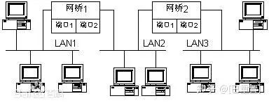
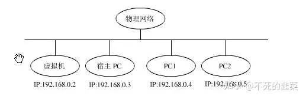
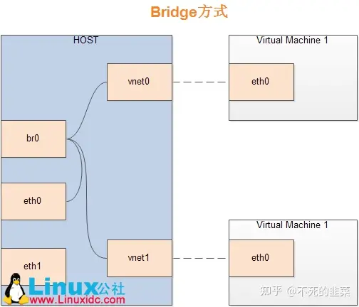

#  网桥

网桥（Bridge）是早期的两端口二层网络设备，用来连接不同网段。网桥的两个端口分别有一条独立的交换信道，不是共享一条背板总线，可隔离冲突域。网桥比集线器（Hub）性能更好，集线器上各端口都是共享同一条背板总线的。后来，网桥被具有更多端口、同时也可隔离冲突域的交换机（Switch）所取代。

网桥（Bridge）像一个聪明的中继器。中继器从一个网络电缆里接收信号，放大它们，将其送入下一个电缆。相比较而言，网桥对从关卡上传下来的信息更敏锐一些。网桥是一种对帧进行转发的技术，根据MAC分区块，可隔离碰撞。网桥将网络的多个网段在数据链路层连接起来。

网桥也叫桥接器，是连接两个局域网的一种存储/转发设备，它能将一个大的LAN分割为多个网段，或将两个以上的LAN互联为一个逻辑LAN，使LAN上的所有用户都可访问服务器。扩展局域网最常见的方法是使用网桥。最简单的网桥有两个端口，复杂些的网桥可以有更多的端口。网桥的每个端口与一个网段相连。

**网桥优点**
1、过滤通信量。网桥可以使用局域网的一个网段上各工作站之间的信息量局限在本网段的范围内，而不会经过网桥溜到其他网段去。
2、扩大了物理范围，也增加了整个局域网上的工作站的最大数目。
3、可使用不同的物理层，可互连不同的局域网。
4、提高了可靠性。如果把较大的局域网分割成若干较小的局域网，并且每个小的局域网内部的信息量明显地高于网间的信息量，那么整个互连网络的性能就变得更好。

**网桥缺点**
1、由于网桥对接收的帧要先存储和查找站表，然后转发，这就增加了时延。
2、在MAC子层并没有流量控制功能。当网络上负荷很重时，可能因网桥缓冲区的存储空间不够而发生溢出，以致产生帧丢失的现象。
3、具有不同MAC子层的网段桥接在一起时，网桥在转发一个帧之前，必须修改帧的某些字段的内容，以适合另一个MAC子层的要求，增加时延。
4、网桥只适合于用户数不太多（不超过几百个）和信息量不太大的局域网，否则有时会产生较大的广播风暴。

## 虚拟机上的网桥

Bridge方式即虚拟网桥的网络连接方式，是客户机和子网里面的机器能够互相通信。**可以使虚拟机成为网络中具有独立IP的主机**。

桥接网络（也叫物理设备共享）被用作把一个物理设备复制到一台虚拟机。网桥多用作高级设置，特别是主机多个网络接口的情况。

如上图，网桥的基本原理就是创建一个桥接接口br0，在物理网卡和虚拟网络接口之间传递数据。